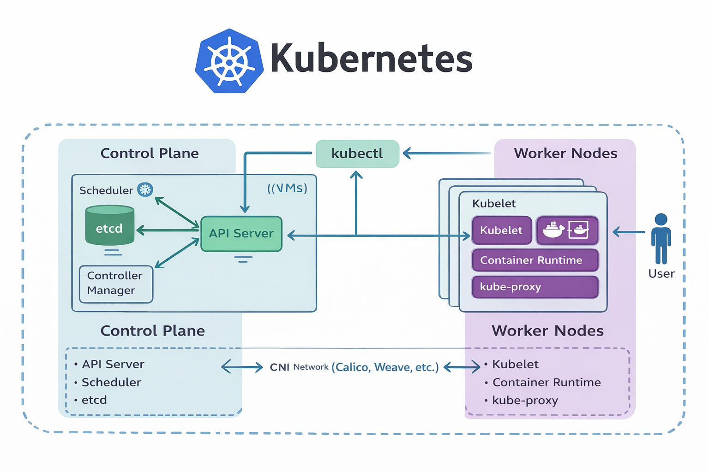

# Kubernetes Fundamentals - Core Theory

This file summarizes the core concepts required before starting practical labs.
Purpose: fast revision and strong conceptual clarity.

## Architecture Overview



A Kubernetes cluster is divided into:
- Control Plane (management layer)
- Worker Nodes (run applications)

## Why Kubernetes Exists

Application evolution:

- `Monolith` → `Microservices` → `Containers` → `Kubernetes`

Containers solved packaging and portability.
Kubernetes solves `container orchestration at scale`.

Kubernetes provides:
- Scheduling
- Self-healing
- Auto scaling
- Service discovery
- Rolling updates
- Desired state enforcement

## Containers vs Kubernetes

### Containers (Docker)
- Package `code` + `runtime` + `dependencies`
- Run well on a single machine

Docker does not handle:
- Multi-node scheduling
- Cluster networking
- Automatic failover
- Replica management

### Kubernetes

Manages containers across multiple machines.

It decides:

- Where containers run
- How many run
- What happens if they fail

## Kubernetes Cluster Structure
### 1. Control Plane (Brain)
> Responsible for cluster management.

**API Server**
- Entry point
- kubectl communicates here
- All operations pass through it

**Scheduler**
- Assigns Pods to nodes

**Controller Manager**
- Ensures desired state matches actual state

**etcd**
- Stores cluster data
- Key-value database

### 2. Worker Nodes (Execution Layer)
> Run application workloads.

**Kubelet**
- Node agent
- Ensures containers are running

**kube-proxy**
- Manages networking rules
- Handles Service traffic

**Container Runtime**
- Runs containers
- containerd (most common)

## Networking (High Level)
- Each Pod gets its own IP
- Pods communicate directly
- Services provide stable access
- CNI plugins enable networking

Examples:
- Calico
- Weave

## Core Kubernetes Principles
### Declarative Model

You declare desired state in YAML.

Kubernetes continuously reconciles:
```txt
Desired State ≠ Actual State → Controller fixes it
```
### Self-Healing
If a Pod crashes:
- Kubernetes recreates it automatically

### Scaling

Workloads can scale:
- Manually
- Automatically (HPA)

## Setup Options
Local Learning
- kubeadm
- minikube
- KIND

Managed Cloud
- EKS 
- AKS
- GKE

## Core Objects (High Level)
### Pod
Smallest deployable unit
One or more containers

### Service
Stable network endpoint for Pods

### Namespace
Logical isolation inside cluster

### Volume
Persistent storage

### Ingress
External HTTP routing

## Mental Model
- Control Plane = Brain
- Workers = Execution layer
- Pods = Running units
- YAML = Desired state
- Controllers = Auto repair system

## Practical Notes

- [1. KIND Installation](./01-kind-installation.md)
- [2. Cluster Creation](./02-cluster-creation.md)
- [3. Namespaces](./03-namespaces.md)
- [4. Pods](./04-pods.md)

## Quick Revision
- Kubernetes = container orchestrator
- Cluster = control plane + workers
- API Server = entry point
- Scheduler = placement engine
- Controllers = enforce desired state
- Kubelet = node agent
- Pods = smallest deployable unit